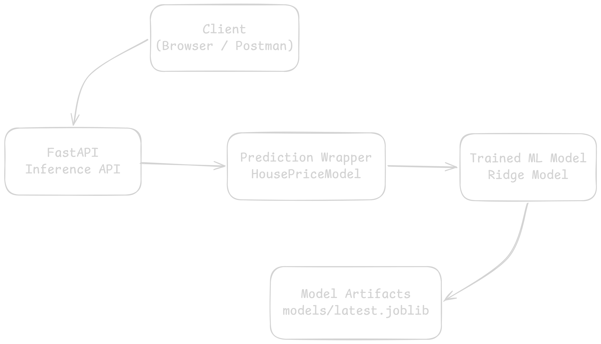
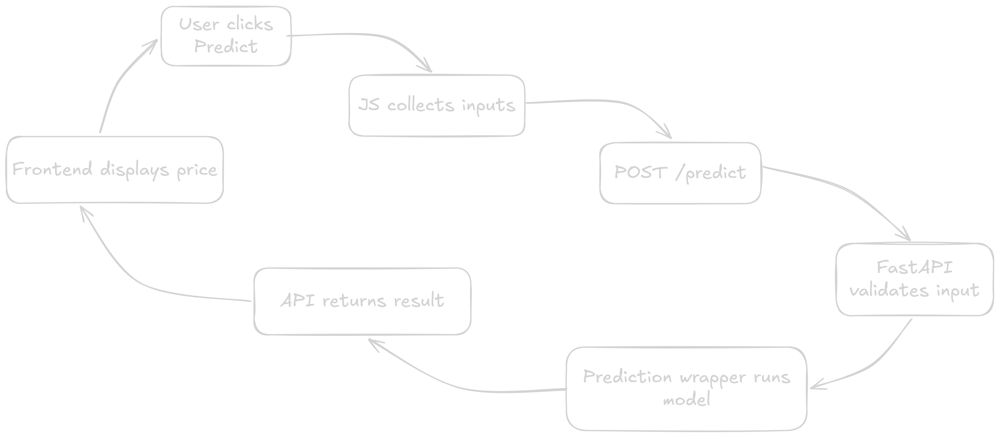
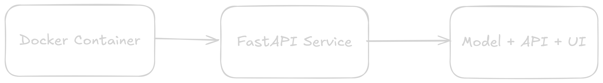
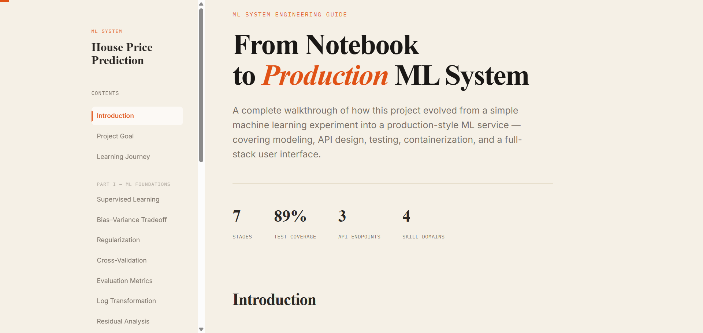
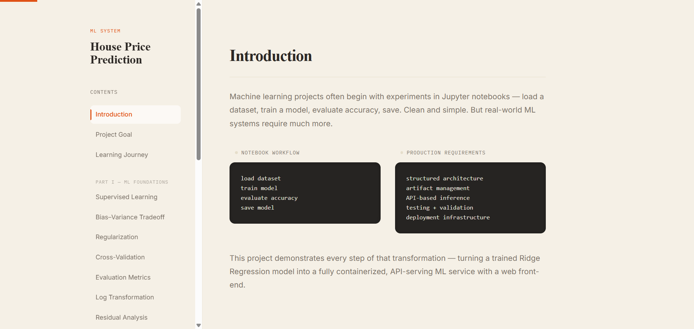

# 🏠 House Price Prediction — End-to-End Machine Learning System


A **production-oriented machine learning system** that demonstrates how to move from **model training to a deployable inference API**.

Unlike typical notebook-based ML projects, this repository focuses on **ML engineering practices**, including:

* reproducible training pipelines
* model artifact management
* API-based inference
* containerized deployment
* automated testing

This project simulates how **real production ML systems are structured and deployed**.

---

### 🚀Live Demo: 
https://house-price-ml-system.onrender.com


---

# 📚 Table of Contents

* Overview
* System Highlights
* Key Features
* System Architecture
* Project Structure
* Prediction Request Lifecycle
* UI Preview
* Model Training Pipeline
* Inference API
* API Endpoints
* Docker Deployment
* Testing
* Engineering Concepts Demonstrated
* Web Interface
* Future Improvements
* Technologies Used
* Running the Project
* Author
* Why This Project Matter

---

# 📌 Overview

This project demonstrates how to build a **complete machine learning service** rather than just a trained model.

The system includes:

* offline model training
* artifact generation and versioning
* REST API for predictions
* containerized deployment using Docker
* automated testing

The architecture separates **training** and **serving**, which is a key principle in production ML systems.

---
# ⭐ System Highlights

✔ Training / Inference separation  
✔ Model artifact versioning  
✔ FastAPI inference service  
✔ Frontend web interface  
✔ Docker containerization  
✔ Automated testing (~89% coverage)  


---

# 🚀 Key Features

* 📊 Machine learning model for house price prediction
* 🧠 Structured ML project architecture
* 🔁 Reproducible training pipeline
* 📦 Model versioning and artifact management
* ⚡ FastAPI inference service
* 🔎 Health monitoring and model metadata endpoints
* 🐳 Docker containerization
* 🧪 Unit testing with high coverage

---

# 🏗 System Architecture

### 1️⃣ ML Lifecycle


<!-- High-level architecture of the system: -->
---
### 2️⃣ System Architecture



---
<!--  -->
### 3️⃣ Request Flow



---
### 4️⃣ Deployment Architecture


The system follows a **two-layer architecture**:

### Training Layer

Responsible for:

* dataset loading
* preprocessing
* model training
* evaluation
* artifact generation

Outputs:

```
models/
   latest.joblib
   versions/
reports/
   model_summary.json
   train_summary.json
```

### Inference Layer

Responsible for:

* loading trained model
* validating requests
* generating predictions
* returning API responses

The inference service is **stateless and containerized**.

---
# 🔄 Prediction Request Lifecycle

1. User enters property features in the web interface.
2. JavaScript collects the inputs.
3. A POST request is sent to /predict.
4. FastAPI validates the request using Pydantic.
5. The prediction wrapper loads the trained model.
6. The model generates a prediction.
7. The API returns the predicted price.
8. The frontend displays the result.


---
# 📁 Project Structure

```
.
├── Dockerfile
├── docker-compose.yml
├── pyproject.toml
├── data/
│   └── Housing.csv
├── models/
│   ├── latest.joblib
│   └── versions/
├── reports/
│   ├── model_summary.json
│   └── train_summary.json
├── src/
│   └── house_price_prediction/
│       ├── api.py
│       ├── config.py
│       ├── loader.py
│       ├── predict.py
│       |── train.py
│       ├── static/
│       │   ├── about.css
│       │   ├── about.html
│       │   ├── index.html
│       │   ├── script.js
│       │   └── style.css
├── tests/
│   ├── test_api.py
│   ├── test_loader_unit.py
│   └── test_predict_unit.py
├── requirements.txt
└── README.md
```


This layout follows a **clean ML project structure** separating:

* training logic
* inference logic
* configuration
* tests
* artifacts

---

# UI Preview
### Home Page 


### About Page



---
## 🧑‍🎓Skills Demonstrated

- Machine Learning Engineering
- Model Deployment
- API Development
- Docker & Containerization
- Testing & CI
- Production ML Architecture

---
# 🤖 Model Training Pipeline

The training pipeline performs the following steps:

1. Load housing dataset
2. Perform feature preprocessing
3. Train a **Ridge Regression model**
4. Evaluate model performance

Metrics used:

* Mean Absolute Error (MAE)
* Root Mean Squared Error (RMSE)

5. Save trained model artifact
6. Generate training summary reports

### Generated Artifacts

```
models/
   latest.joblib
   versions/
       ridge_timestamp.joblib

reports/
   model_summary.json
   train_summary.json
```

These artifacts enable **model versioning and reproducibility**.

---

# ⚡ Inference API

Predictions are served through a **FastAPI application**.

Responsibilities of the inference service:

* load trained model at startup
* validate incoming input data
* convert request payload into model format
* generate prediction
* return response

---

# 🔌 API Endpoints

| Endpoint      | Method | Description                     |
| ------------- | ------ | ------------------------------- |
| `/health`     | GET    | Service health status           |
| `/predict`    | POST   | Generate house price prediction |
| `/model-info` | GET    | Metadata of deployed model      |

---

## Health Check

```
GET /health
```

Response

```json
{
  "status": "ok",
  "model_loaded": true
}
```

---

## Prediction Endpoint

```
POST /predict
```

Example request

```json
{
  "bedrooms": 4,
  "bathrooms": 2,
  "stories": 2,
  "parking": 3,
  "area": 4235,
  "mainroad": "yes",
  "guestroom": "no",
  "basement": "yes",
  "hotwaterheating": "no",
  "airconditioning": "yes",
  "prefarea": "yes",
  "furnishingstatus": "no"
}
```

Example response

```json
{
  "prediction": 2450000.0
}
```

Input validation is handled using **Pydantic schemas**.

---

## Model Metadata

```
GET /model-info
```

Example response

```json
{
  "model_name": "ridge",
  "train_mae": 21345,
  "train_rmse": 31200
}
```

This endpoint allows engineers to **verify which model version is currently deployed**.

---

# 🐳 Docker Deployment

The service is containerized using **Docker** to ensure consistent runtime environments.

### Build Image

```bash
docker build -t house-price-api .
```

### Run Container

```bash
docker run -p 8000:8000 house-price-api
```

API will be available at

```
http://localhost:8000
```

---

## Docker Compose (Recommended)

```
docker compose up
```

API documentation:

```
http://localhost:8000/docs
```

FastAPI automatically generates interactive API documentation.

---

# 🧪 Testing

The project includes **unit tests** for:

* API endpoints
* model loading
* prediction logic

Run tests

```bash
pytest
```

Check coverage

```bash
coverage run -m pytest
coverage report
```

---

# ⚙ Engineering Concepts Demonstrated

This project demonstrates several **real-world ML engineering practices**:

* separation of training and inference
* configuration management
* dependency injection
* model artifact storage
* API-based inference services
* health monitoring
* containerized deployment
* automated testing

---
# 🌐 Web Interface

The system includes a simple frontend UI that allows users to interact with the model.

Workflow:

User → Web UI → FastAPI API → Prediction Model

The frontend collects house features and sends them to the API using JavaScript fetch requests.

---

# 🔮 Future Improvements

Possible extensions:

* CI/CD pipeline for automated builds
* model registry integration
* cloud deployment

---

# 🛠 Technologies Used

* Python
* Scikit-learn
* FastAPI
* Pydantic
* Docker
* Pytest

---

# ▶ Running the Project

### 1 Clone Repository

```bash
git clone https://github.com/Atharv-AC/house-price-ml-system.git
```

## Option 1:
### 2 Build Docker Image

```bash
docker build -t house-price-api .
```

### 3 Run Container

```bash
docker run -p 8000:8000 house-price-api
```

### 4 Open API Docs

```
http://localhost:8000/docs
```

---
## Option 2:
### Local Development Instructions

```bash
pip install -e .
uvicorn src.house_price_prediction.api:app --reload
```

# 👨‍💻 Author

**Atharv Chandurkar**

Machine Learning Engineering Project

---

# ⭐ Why This Project Matters

Most machine learning tutorials focus only on training models in notebooks.

This project demonstrates how to build a **complete ML system**, including:

* reproducible training
* model artifact management
* API-based inference
* containerized deployment
* automated testing

These practices reflect **real production ML workflows used in industry**.
